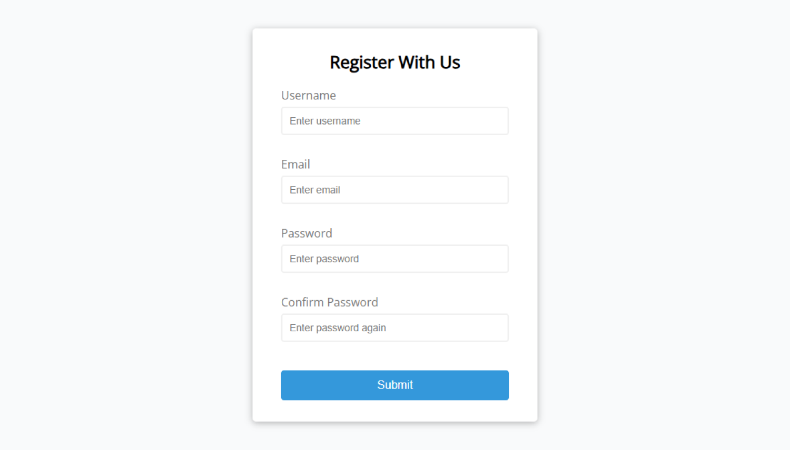
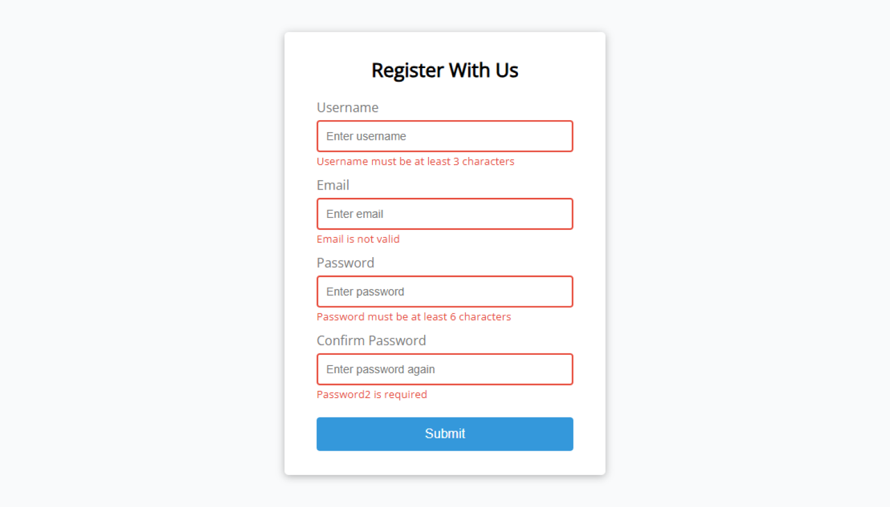
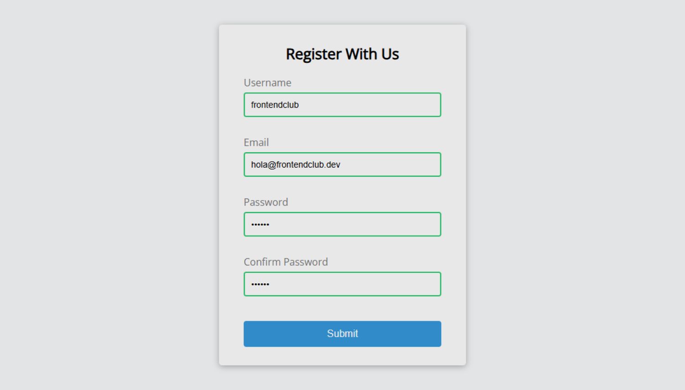

# EP01: Form Validator

<link rel="stylesheet" href="/css/style.css">

<div class="carousel-container">

  <input type="radio" name="carousel" id="slide1" checked>
  <input type="radio" name="carousel" id="slide2">
  <input type="radio" name="carousel" id="slide3">

  <div class="carousel-slide">
    
    
    
  </div>

  <div class="carousel-nav">
    <label for="slide1">●</label>
    <label for="slide2">●</label>
    <label for="slide3">●</label>
  </div>
</div>

---

## 1️⃣ Acerca del reto

En este reto vas a construir un formulario de registro moderno y funcional que valide los datos ingresados por el usuario antes de enviarlos.
Aprenderás a detectar errores, mostrar mensajes útiles y crear una experiencia de usuario más profesional.

---

## 2️⃣ Habilidades a reforzar

- Estructura semántica en HTML
- Selectores y estilos básicos en CSS
- Eventos (`submit`, `input`, `blur`) en JavaScript
- Validaciones de formularios (manuales)
- Manejo del DOM
- Mostrar mensajes de error de forma dinámica
- Pensamiento lógico y buenas prácticas de UX

---

## 3️⃣ Estructura de carpetas

Crea tu proyecto con la siguiente estructura:

```md
form-validator/
│
├── index.html
├── style.css
├── script.js
└── readme.md
```

---

## 4️⃣ Nivel de dificultad

🏍️ Principiante

Este reto es perfecto si estás dando tus primeros pasos con JavaScript.
La interfaz ya está definida, así que puedes concentrarte en aprender cómo capturar eventos, validar datos y modificar el DOM con JS puro.

---

## 5️⃣ Tips

- Usa `addEventListener('submit', ...)` para capturar el evento al hacer clic en el botón.
- Evita que el formulario se envíe si hay errores con `event.preventDefault()`.
- Usa expresiones regulares (`regex`) para validar correos electrónicos.
- Aplica clases CSS para resaltar errores o éxitos (`.error`, `.success`).
- Dale feedback claro al usuario: qué campo está mal y por qué.

---

## 6️⃣ Bonus (para subir de nivel)

🎯 Si terminas lo básico, intenta lo siguiente:

- ✅ Desactiva el botón hasta que todos los campos sean válidos.
- ✅ Agrega íconos de ✅ o ❌ según la validación.
- ✅ Guarda los datos temporalmente en `localStorage`.
- ✅ Valida la fortaleza de la contraseña (longitud, números, símbolos, etc.).
- ✅ Anima los errores con CSS (ej. sacudida leve o cambio de color progresivo).

---

## 7️⃣ Comunidad

¿Atascado en alguna parte? ¿Quieres compartir tu resultado?

- 📸 Comparte una captura en tu red favorita.
- 🔁 Rétate a ti mismo recreando el formulario con otro diseño.
- 💬 Pide feedback a otros desarrolladores.
- 🧠 Aprende más viendo cómo otros resolvieron lo mismo.

👉 **[ÚNETE A LA COMUNIDAD EN WHATSAPP](https://chat.whatsapp.com/CldsuiaJ52t3NvDg47zaWP)**

---

> “La mejor manera de aprender a programar es escribiendo código todos los días.” — **Frontend Club**