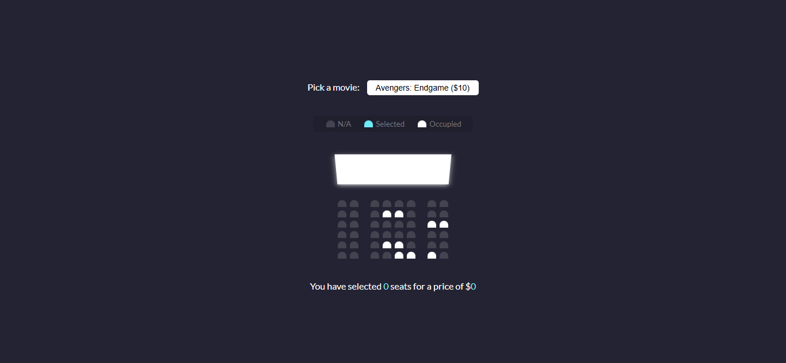
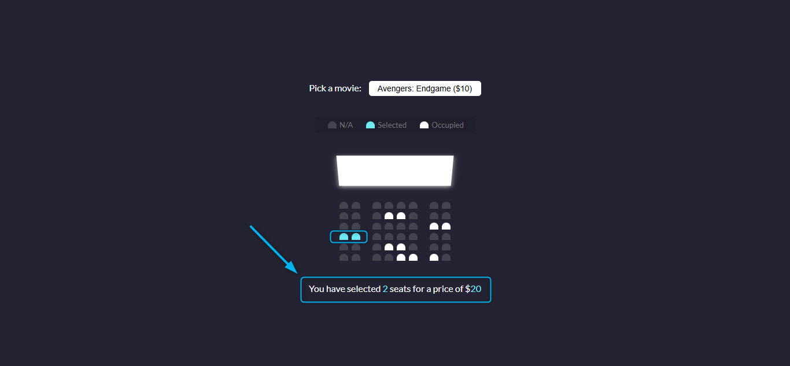

# EP02: Movie Seat Booking

<link rel="stylesheet" href="/css/style.css">

<div class="carousel-container">

  <input type="radio" name="carousel" id="slide1" checked>
  <input type="radio" name="carousel" id="slide2">

  <div class="carousel-slide">
    
    
  </div>

  <div class="carousel-nav">
    <label for="slide1">●</label>
    <label for="slide2">●</label>
  </div>
</div>

---

## 1️⃣ Acerca del reto

¿Alguna vez reservaste asientos para una película?
En este reto vas a recrear exactamente esa experiencia: un sistema visual donde puedes elegir tus asientos, cambiar la película y ver cómo el precio total se actualiza en tiempo real. 🪑🎟️

---

## 2️⃣ Habilidades a reforzar

- Manipulación avanzada del DOM con JavaScript
- Control de eventos (`click`, `change`, etc.)
- Uso del método `classList` para cambiar estilos
- Cálculos dinámicos (precio × asientos)
- Almacenamiento de datos en `localStorage`
- Interacción entre elementos HTML (select + divs)

---

## 3️⃣ Estructura de carpetas

Organiza tu reto así:

```md
movie-seat-booking/
│
├── index.html
├── style.css
├── script.js
└── readme.md
```

---

## 4️⃣ Nivel de dificultad

🏎️ Intermedio

Este reto es un paso más allá del anterior. Aunque el diseño ya está listo, ahora tienes que pensar en estados: ocupado, disponible, seleccionado, y además guardar la selección del usuario en el navegador.

---

## 5️⃣ Tips

- Asigna clases como `.occupied`, `.selected`, `.seat` y usa `querySelectorAll` para recorrerlas.
- Usa `dataset` para almacenar el índice de cada asiento.
- Escucha el cambio de película (`change` en `<select>`) y recalcula el precio.
- Guarda la selección del usuario con `localStorage.setItem()` para mantener su elección aunque recargue.
- Refactoriza tu código: divide en funciones pequeñas (`updateSelectedCount()`, `populateUI()`, etc.).

---

## 6️⃣ Bonus

¿Quieres ir más allá? Aquí tienes algunas ideas:

- 🎥 Agrega más películas al `<select>` con diferentes precios.
- 🧠 Haz que se recuerde la película elegida en `localStorage`.
- 🎨 Muestra los nombres o coordenadas de los asientos seleccionados.
- 🔒 Impide seleccionar los asientos ocupados.
- 📱 Hazlo responsive para dispositivos móviles.

---

## 7️⃣ Comunidad

Este proyecto es genial para compartir y aprender en conjunto:

- 📸 Sube una captura o screen recording mostrando cómo funciona.
- 🧑‍💻 Intercambia tu código con otros: ¿cómo resolvieron el `localStorage`?
- 🎥 ¿Te animas a grabar un mini tutorial explicando cómo lo hiciste?

👉 **[ÚNETE A LA COMUNIDAD EN WHATSAPP](https://chat.whatsapp.com/CldsuiaJ52t3NvDg47zaWP)**

---

> "Cada clic en un asiento es una oportunidad para dominar JavaScript. Pequeños proyectos como este son los que te llevan a pensar como un verdadero desarrollador frontend."