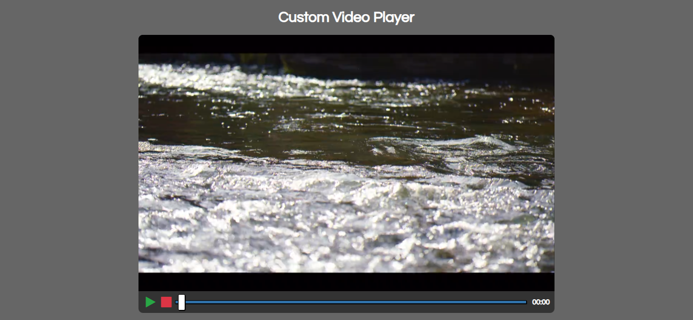
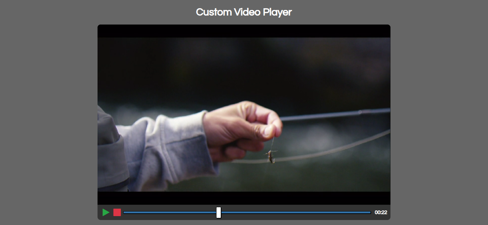

# EP03: Custom Video Player

<link rel="stylesheet" href="/css/style.css">

<div class="carousel-container">

  <input type="radio" name="carousel" id="slide1" checked>
  <input type="radio" name="carousel" id="slide2">

  <div class="carousel-slide">
    
    
  </div>

  <div class="carousel-nav">
    <label for="slide1">●</label>
    <label for="slide2">●</label>
  </div>
</div>

---


## 1️⃣ Acerca del reto

Vas a construir un **reproductor de video personalizado**, sin depender de los controles nativos del navegador. Tendrás control total con tus propios botones de:

- ▶️ **Reproducir**
- ⏸️ **Pausar**
- ⏹️ **Terminar (detener)**
- 📈 **Una barra de progreso** que muestre visualmente cómo avanza el video
- ⏱️ Un **temporizador** con el tiempo actual de reproducción

---

## 2️⃣ Habilidades a reforzar

- Control total del elemento `<video>` con JavaScript
- Manejo de eventos (`click`, `timeupdate`, `change`, etc.)
- Manipulación del DOM y estilos dinámicos
- Lógica condicional para estados de reproducción
- Precisión con cálculos de tiempo y porcentaje

---

## 3️⃣ Estructura de carpetas

Organiza tu proyecto así:

```md
custom-video-player/
│
├── index.html
├── style.css
├── script.js
├── video.mp4
└── readme.md
```

📝 Tip: Usa un video corto en formato .mp4 para pruebas, o reutiliza el que viene en los recursos del reto.

---

## 4️⃣ Nivel de dificultad

🏎️ Intermedio tirando a avanzado

Este reto requiere más lógica que diseño. Vas a trabajar con eventos que cambian con el tiempo (¡como el progreso del video!), lo que lo hace ideal para pensar como un desarrollador profesional.

---

## 5️⃣ Tips

- Usa `video.play()` y `video.pause()` para controlar la reproducción.
- `video.currentTime` y `video.duration` son tus aliados para la barra de progreso.
- Agrega `eventListeners` a cada botón y sincroniza con el video.
- Usa `Math.floor()` o `toFixed()` para mostrar los segundos limpios.
- La barra de progreso puede ser un `<input type="range">`, actualízala con value.

---

## 6️⃣ Bonus

🔥 Si quieres que tu reproductor sea nivel YouTube:

- ⏪ Agrega botones de retroceder/adelantar 10 segundos.
- 🔈 Muestra un ícono distinto si el volumen está muteado.
- 🌙 Crea un modo oscuro para el player.
- 📱 Hazlo responsive y con un diseño atractivo.
- 💡 Añade una mini preview al pasar el mouse sobre la barra de progreso.

---

## 7️⃣ Comunidad

Este es un reto con MUCHO potencial visual, así que:

- 🎥 Graba un mini demo mostrando cómo se ve tu reproductor.
- 🧠 Comparte tu código y recibe feedback en la comunidad.
- 🎨 Experimenta con diferentes estilos y compártelos: ¡quizá inspires a alguien más!

👉 **[ÚNETE A LA COMUNIDAD EN WHATSAPP](https://chat.whatsapp.com/CldsuiaJ52t3NvDg47zaWP)**

---

> "Cada línea de código que escribes es un paso más hacia la libertad de crear lo que imaginas.
Aprender a programar todos los días, aunque sea solo un poco, te convierte en un mejor constructor de ideas."