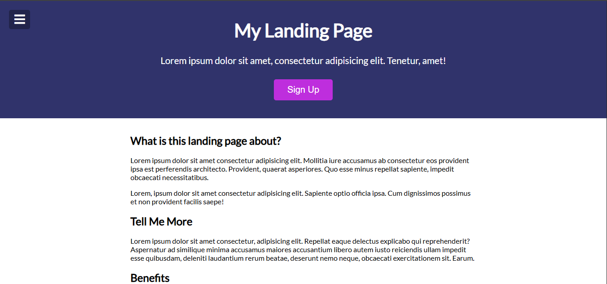
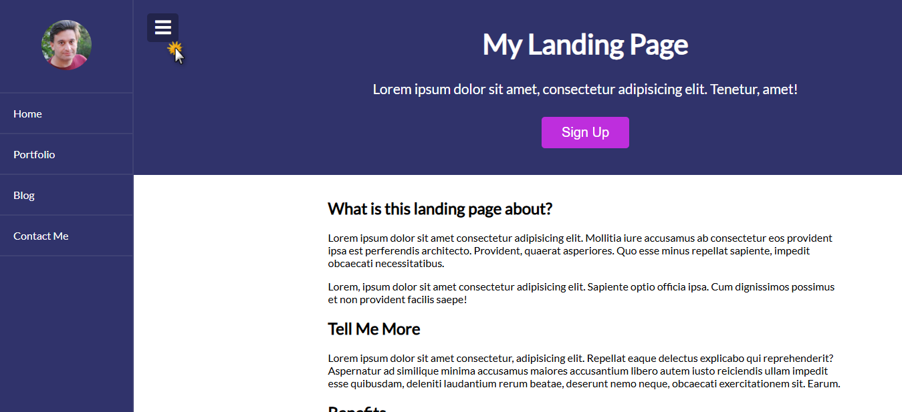
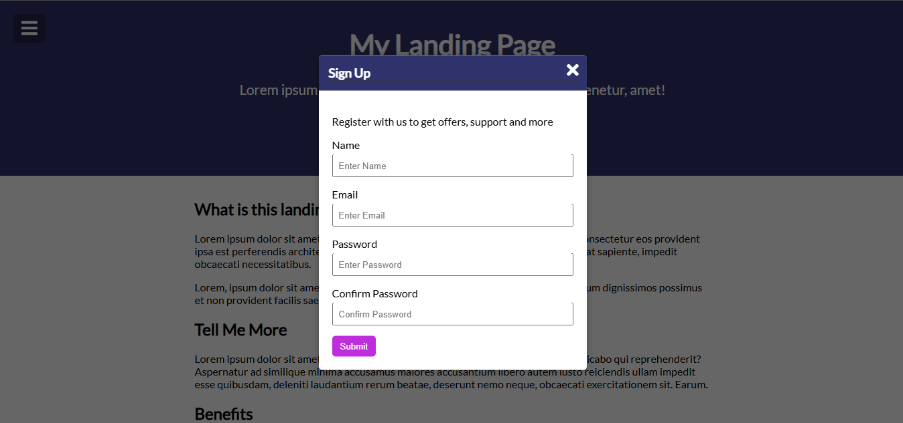

# EP06: Landing Page

<link rel="stylesheet" href="/css/style.css">

<div class="carousel-container">

  <input type="radio" name="carousel" id="slide1" checked>
  <input type="radio" name="carousel" id="slide2">
  <input type="radio" name="carousel" id="slide3">

  <div class="carousel-slide">
    
    
    
  </div>

  <div class="carousel-nav">
    <label for="slide1">●</label>
    <label for="slide2">●</label>
    <label for="slide3">●</label>
  </div>
</div>

---

## 1️⃣ Acerca del reto
Nuestra misión de hoy será crear una landing page moderna con un menú lateral estilo hamburguesa que se adapta a pantallas pequeñas 📱. El enfoque está en el diseño responsive, interactividad básica con JavaScript y buenas prácticas visuales.

---

## 2️⃣ Habilidades a reforzar
- ✅ Maquetación HTML + CSS
- ✅ Diseño responsivo con media queries
- ✅ Uso básico de Flexbox
- ✅ JavaScript para interacción (toggle class)
- ✅ Estructura de carpetas limpia y escalable

---

## 3️⃣ Estructura de carpetas

```md
landing-page/
├─ css/
│  └─ style.css
├─ js/
│  └─ main.js
├─ img/
│  └─ avatar.jpg
├─ index.html
├─ README.md
```

📝 Mantén carpetas separadas para organizar estilos, scripts e imágenes.

---

## 4️⃣ Nivel de dificultad
🟠 Intermedio bajo

Si ya dominas HTML básico y CSS, este reto te ayudará a subir de nivel incorporando diseño adaptable y JS ligero.

---

## 5️⃣ Tips

**🧠 Buenas prácticas:**  

- Usa `class=""` en lugar de `id=""` para crear estilos reutilizables.
- Empieza tu CSS con:

```css
* { margin: 0; padding: 0; box-sizing: border-box; }
```
- Usa `rem` para tamaños en lugar de `px`.

---

## 6️⃣ Bonus
👉 Agrega una animación de entrada con CSS:

```css
.sidebar { transition: transform 0.3s ease; }
.sidebar.active { transform: translateX(0); }
```

---

## 7️⃣ Comunidad

Únete a la comunidad **#20vanillajsprojects**, donde aprender no es una carrera solitaria, sino una aventura compartida. Aquí puedes hacer preguntas, encontrar inspiración y crecer junto a otras personas que también están construyendo desde cero, como tú.

**Aprender con otros tiene sus cosas buenas:**

- 💬 Puedes resolver tus dudas más rápido cuando compartes tus preguntas.
- 👀 Ver cómo otros resuelven los mismos retos te da ideas frescas.
- 🔥 La motivación se multiplica cuando ves que no estás solo en el camino.
- 🙌 Compartir tus avances te da confianza (y visibilidad para tu portafolio).
- 🌐 Haces conexiones reales con gente apasionada como tú.

👉 **[ÚNETE A LA COMUNIDAD EN WHATSAPP](https://chat.whatsapp.com/CldsuiaJ52t3NvDg47zaWP)**

---

> "El código perfecto no existe, pero el que escribes hoy te hace mejor que ayer." 💪✨
> 