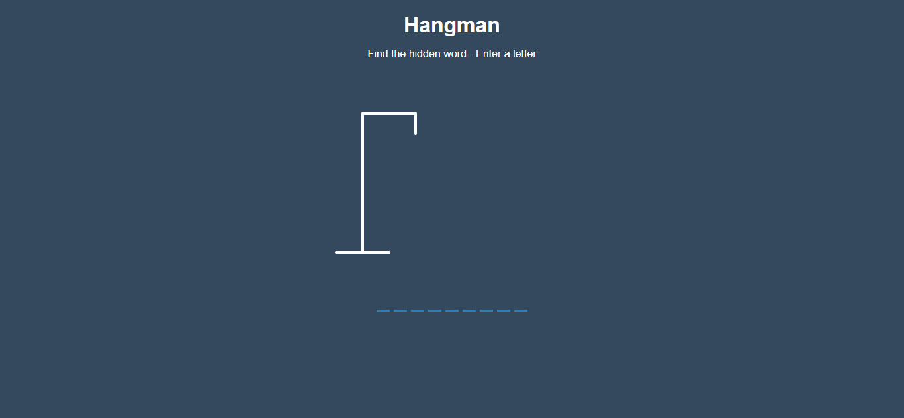
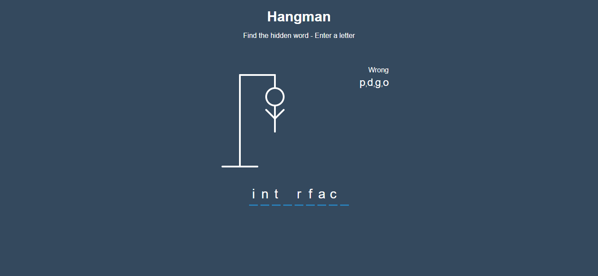
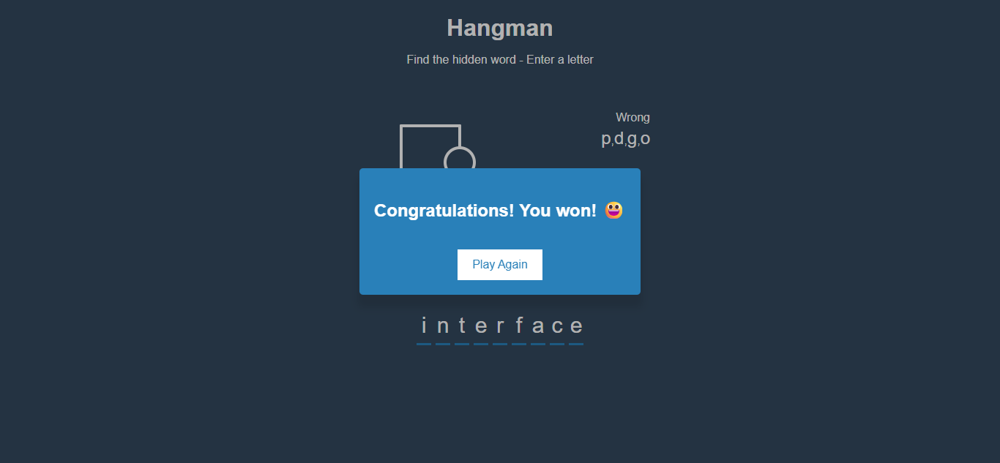

# EP07: Hangman Game

<link rel="stylesheet" href="/css/style.css">

<div class="carousel-container">

  <input type="radio" name="carousel" id="slide1" checked>
  <input type="radio" name="carousel" id="slide2">
  <input type="radio" name="carousel" id="slide3">

  <div class="carousel-slide">
    
    
    
  </div>

  <div class="carousel-nav">
    <label for="slide1">●</label>
    <label for="slide2">●</label>
    <label for="slide3">●</label>
  </div>
</div>


---

## 1️⃣ Acerca del reto

En este reto vas a construir un clásico juego del ahorcado con HTML, CSS y JavaScript. El objetivo es que el usuario adivine una palabra oculta ingresando letras. Cada error dibuja una parte del muñeco... y si se equivoca mucho, ¡Game Over!
Este reto es perfecto para practicar la lógica de interacción entre usuario y sistema, y te va a obligar a pensar como un desarrollador frontend en la vida real.

---

## 2️⃣ Habilidades a reforzar

Al construir este juego vas a reforzar conocimientos muy valiosos:

- ✅ Manipulación del DOM – mostrar letras correctas, ocultar otras, actualizar la interfaz en tiempo real.
- ✅ Eventos de teclado – capturar la letra que escribe el usuario con `keydown`.
- ✅ Lógica condicional y estructuras de control – detectar si una letra está en la palabra o no.
- ✅ Diseño con CSS puro – dibujar el muñeco del ahorcado con líneas y formas básicas.
- ✅ Control de estado del juego – controlar cuándo el jugador gana o pierde.
- ✅ Arreglos y strings – manipulación de letras, validaciones y actualización de arrays.

---

## 3️⃣ Estructura de carpetas

Organiza bien tu proyecto desde el inicio:

```md
hangman-game/
│
├── 📁 css/
│   └── style.css              # Estilos del juego
│
├── 📁 js/
│   └── main.js                # Lógica principal del juego
│
├── 📁 data/
│   └── words.js               # Lista de palabras para jugar (puedes crearla tú)
│
├── index.html                 # Página principal del juego
└── README.md                  # Documentación del reto (opcional pero recomendado)
```

## 4️⃣ Nivel de dificultad

🟨 Intermedio

Perfecto si ya dominas lo básico de JavaScript. Te reta lo justo, sin ser frustrante.

---

## 5️⃣ Tips

🧠 Aquí van algunos consejos que te harán la vida más fácil:

- Usa `document.addEventListener("keydown", callback)` para capturar teclas.
- Guarda la palabra en un arreglo y actualiza otro arreglo para mostrar el progreso del jugador.
- Dibuja cada parte del muñeco usando `display: none` y muéstralas progresivamente con cada error.
- Usa clases CSS para manejar el estilo de letras correctas y errores.
- Evita repetir código. Crea funciones como `showWrongLetters()`, `drawHangman()`, `checkWin()`.

---

## 6️⃣ Bonus

¿Quieres ir más allá? Aquí tienes ideas para hacer brillar tu proyecto:

- ✨ Botón de reiniciar el juego sin recargar la página.
- ✨ Animaciones suaves al mostrar letras o partes del muñeco.
- ✨ Contador de victorias y derrotas.
- ✨ Modo oscuro / claro.
- ✨ Palabras aleatorias desde una API o archivo externo.
- ✨ Dificultad configurable (fácil, medio, difícil).
- ✨ Soporte para teclado móvil.

---

## 7️⃣ Comunidad

¿Tienes dudas con tu código? ¿Te atascaste en un reto? ¿Te gustaría compartir tus avances o conocer cómo otros están resolviendo los mismos desafíos?

No estás solo.

Aprender a programar puede ser solitario a veces, pero no tiene por qué serlo. En nuestra comunidad de WhatsApp encontrarás personas como tú: curiosas, apasionadas por la tecnología, y con ganas de aprender y mejorar cada día.

🚀 **¿Qué ganas al unirte?**

- Recibir apoyo cuando te bloquees
- Compartir tus avances y obtener feedback
- Conocer a otros estudiantes y motivarte
- Participar en retos, dinámicas y actividades grupales

👉 **[ÚNETE A LA COMUNIDAD EN WHATSAPP](https://chat.whatsapp.com/CldsuiaJ52t3NvDg47zaWP)**

---

> “No se trata solo de escribir código, se trata de entrenar tu mente para resolver problemas como un verdadero programador.”
