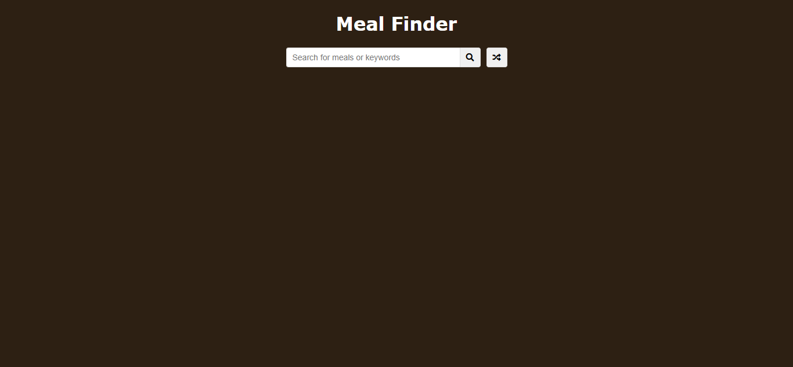
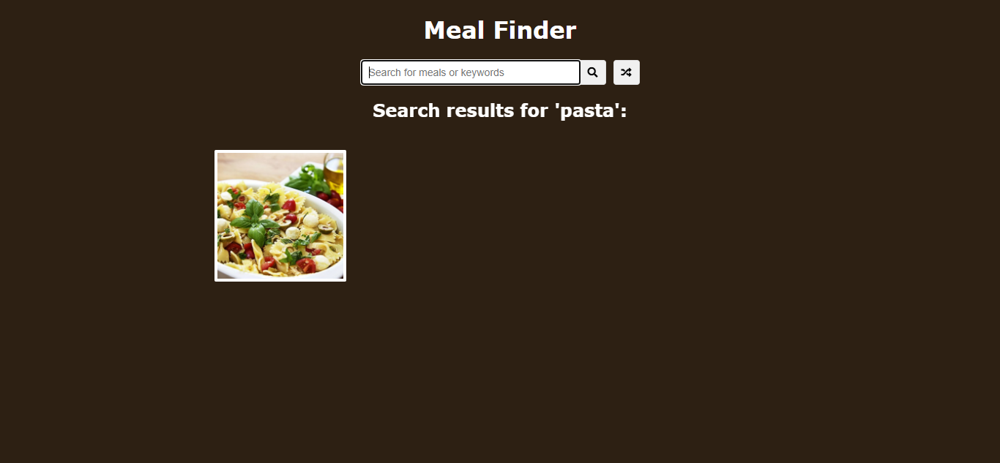
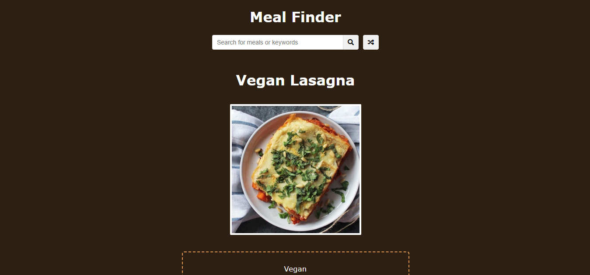

# EP08: Meal Finder

<link rel="stylesheet" href="/css/style.css">

<div class="carousel-container">

  <input type="radio" name="carousel" id="slide1" checked>
  <input type="radio" name="carousel" id="slide2">
  <input type="radio" name="carousel" id="slide3">

  <div class="carousel-slide">
    
    
    
  </div>

  <div class="carousel-nav">
    <label for="slide1">●</label>
    <label for="slide2">●</label>
    <label for="slide3">●</label>
  </div>
</div>


--- 

## 1️⃣ Acerca del reto

En este reto vas a construir una aplicación web que permite buscar recetas de comida ingresando una palabra clave o usando un botón que selecciona una receta al azar. El resultado mostrará el nombre del platillo, una imagen, el tipo de comida, la receta detallada y una lista de ingredientes.

Un proyecto ideal para practicar cómo consumir y mostrar datos desde una API externa de forma dinámica y atractiva.

---

## 2️⃣ Habilidades a reforzar

Con este reto pondrás en práctica y reforzarás:

- Uso de APIs REST (API de comidas)
- Manipulación del DOM con JavaScript
- Fetch API y manejo de promesas
- Interacción usuario-API
- Buenas prácticas en HTML semántico y CSS responsive
- Limpieza y organización de código

---

## 3️⃣ Estructura de carpetas

```md
meal-finder/
├── index.html
├── README.md
├── /assets
│   └── /images (si usas imágenes propias)
├── /css
│   └── style.css
├── /js
│   └── script.js
```

---

## 4️⃣ Nivel de dificultad

🟡 Intermedio – Ideal si ya manejas HTML, CSS y estás dando tus primeros pasos con JavaScript y consumo de APIs.

---

## 5️⃣ Tips

Buenas prácticas:

- Usa `fetch()` para obtener los datos desde la API de [MealDB](https://www.themealdb.com/api.php).
- Crea funciones pequeñas y reutilizables para mantener el código organizado.
- Usa `innerHTML` con cuidado para evitar errores de seguridad (XSS).
- Muestra un mensaje amigable si no se encuentra ninguna receta.
- Puedes usar `async/await` para hacer tu código más legible.

---

## 6️⃣ Bonus

¿Quieres ir más allá? Aquí tienes ideas:

- Agrega una opción para guardar recetas favoritas en `localStorage`.
- Agrega filtros por categorías: postres, cenas rápidas, saludables, etc.
- Muestra videos de recetas si están disponibles en la API.
- Agrega paginación para mostrar más resultados.
- Implementa modo oscuro (dark mode) con CSS.

---

## 7️⃣ Comunidad

¿Tienes dudas con tu código? ¿Te atascaste en un reto? ¿Te gustaría compartir tus avances o conocer cómo otros están resolviendo los mismos desafíos?

No estás solo.

Aprender a programar puede ser solitario a veces, pero no tiene por qué serlo. En nuestra comunidad de WhatsApp encontrarás personas como tú: curiosas, apasionadas por la tecnología, y con ganas de aprender y mejorar cada día.

🚀 **¿Qué ganas al unirte?**

- Recibir apoyo cuando te bloquees
- Compartir tus avances y obtener feedback
- Conocer a otros estudiantes y motivarte
- Participar en retos, dinámicas y actividades grupales

👉 **[ÚNETE A LA COMUNIDAD EN WHATSAPP](https://chat.whatsapp.com/CldsuiaJ52t3NvDg47zaWP)**

---

> "No estás solo. Estamos construyendo juntos."

> "Línea por línea, error por error… hasta que el código funcione."