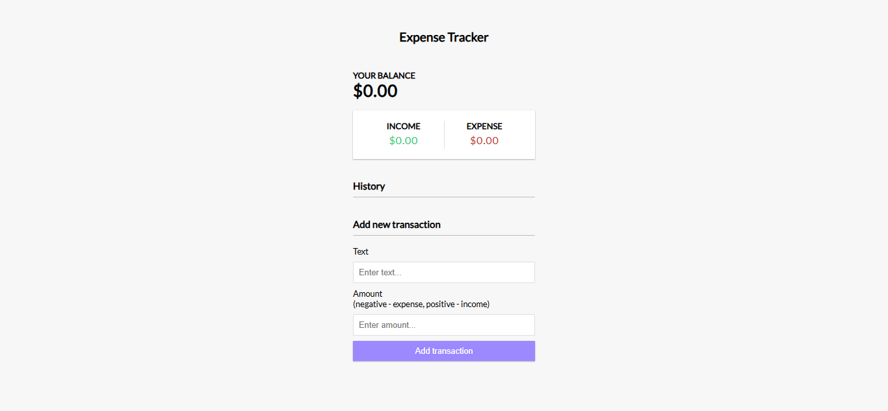
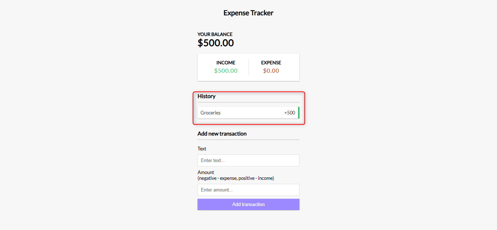
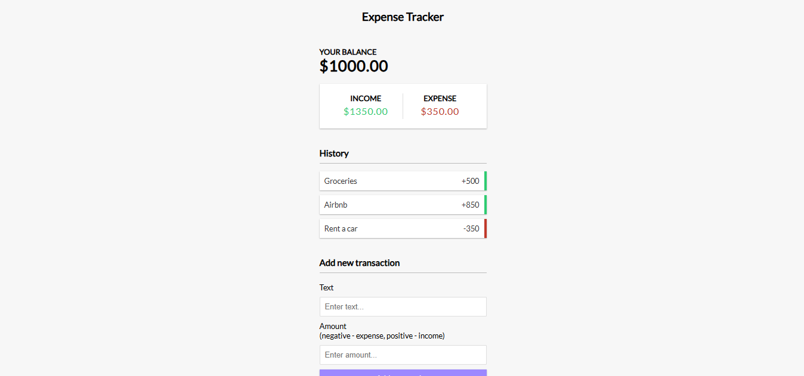

# EP09: Expense Tracker

<link rel="stylesheet" href="/css/style.css">

<div class="carousel-container">

  <input type="radio" name="carousel" id="slide1" checked>
  <input type="radio" name="carousel" id="slide2">
  <input type="radio" name="carousel" id="slide3">

  <div class="carousel-slide">
    
    
    
  </div>

  <div class="carousel-nav">
    <label for="slide1">●</label>
    <label for="slide2">●</label>
    <label for="slide3">●</label>
  </div>
</div>

--- 

## 1️⃣ Acerca del reto

En este reto vas a construir una aplicación que te permite registrar tus ingresos y gastos para llevar el control de tu dinero en tiempo real. Podrás agregar transacciones con texto y monto, y la app calculará automáticamente tu balance total, ingresos y egresos.

Este proyecto es una excelente forma de practicar el manejo del estado de una app en JavaScript puro.

---

## 2️⃣ Habilidades a reforzar

Con este reto pondrás en práctica y reforzarás:

- Manipulación del DOM con JavaScript
- Eventos en formularios (`submit`, `input`, etc.)
- Cálculos dinámicos y actualizaciones de UI
- Lógica condicional y operaciones con arrays
- Manejo de localStorage para persistencia de datos
- Estructura de carpetas y separación de responsabilidades

---

## 3️⃣ Estructura de carpetas

```md
expense-tracker/
├── index.html
├── README.md
├── /css
│   └── style.css
├── /js
│   └── script.js
└── /assets
    └── /images (si decides agregar íconos o recursos gráficos)
```

---

## 4️⃣ Nivel de dificultad

🟡 Intermedio – Perfecto si ya dominas lo básico de JavaScript y quieres mejorar tus habilidades para construir aplicaciones con lógica de negocio.

---

## 5️⃣ Tips

Buenas prácticas y sugerencias:

- Cada transacción debe tener un identificador único. Puedes usar `Date.now()` o una librería como `uuid` (si usas herramientas externas).
- Usa `localStorage` para guardar el historial y que no se borre al recargar.
- Separa bien tu lógica: una función para agregar, otra para eliminar, y otra para recalcular el balance.
- Valida que el usuario no deje los campos vacíos antes de agregar una transacción.
- Puedes usar colores para diferenciar ingresos (+) y egresos (–).

---

## 6️⃣ Bonus

¿Quieres ir más allá? Aquí tienes algunas ideas:

- Agrega filtros por mes, categoría o tipo de gasto.
- Muestra gráficos con librerías como `Chart.js` para visualizar tu dinero.
- Añade edición de transacciones ya creadas.
- Calcula tu ahorro automático al final del mes.
- Hazlo responsive y crea una versión `mobile-friendly`.

---

## 7️⃣ Comunidad

¿Tienes dudas con tu código? ¿Te atascaste en un reto? ¿Te gustaría compartir tus avances o conocer cómo otros están resolviendo los mismos desafíos?

Aprender a programar puede ser solitario a veces, pero no tiene por qué serlo. En nuestra comunidad de WhatsApp encontrarás personas como tú: curiosas, apasionadas por la tecnología, y con ganas de aprender y mejorar cada día.

🚀 **¿Qué ganas al unirte?**

- Recibir apoyo cuando te bloquees
- Compartir tus avances y obtener feedback
- Conocer a otros estudiantes y motivarte
- Participar en retos, dinámicas y actividades grupales

👉 **[ÚNETE A LA COMUNIDAD EN WHATSAPP](https://chat.whatsapp.com/CldsuiaJ52t3NvDg47zaWP)**

---

> “Controlar tu dinero es el primer paso para tener libertad. Aprender a programar te da las herramientas para construir esa libertad.”